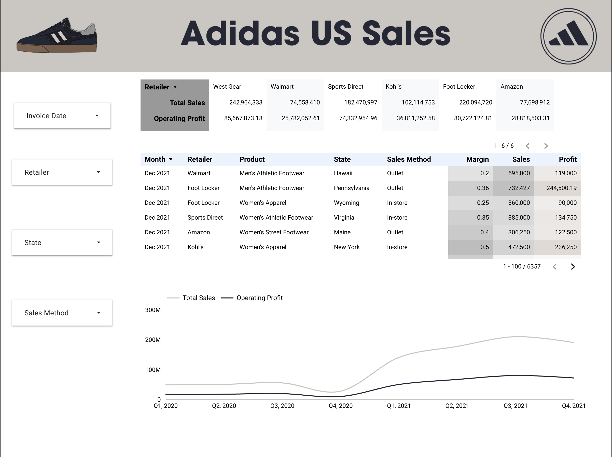

# adidas-us-sales-dashboard

Visual Analysis of Adidas U.S. Sales using different dimensions and metrics 📊📈

--

Project Highlights:🔋🔌💡

- KPIs: Total Sales, Profit, Top/Bottom Regions, Products, and Retailers
- Controls: Yearly Quarters, Products, Regions, State, Sales Method
- Charts:
    - Total Sales along with Profit by Region
    - Total Sales along with Profit by Product
    - Overall Total Sales and Profit by Yearly Quarter
 
--

## Screenshots 📸💵

### Dashboard Overview 

### Charts and Tables Overview 

---

## Tools Used 💻⌨️

- Google Looker Studio for the Dashboard
- Google Sheets to connect the Adidas US Sales Dataset to Looker Studio 

---

## Overall 👾👍

-- Learned KPI Creation, charting, and using controls 
-- Applied Clean designs to communicate insights clearly 
-- An issue I ran into was with the time series chart; edits done to one series would also alter the other 
which led to the chart not looking exactly how I wanted.
